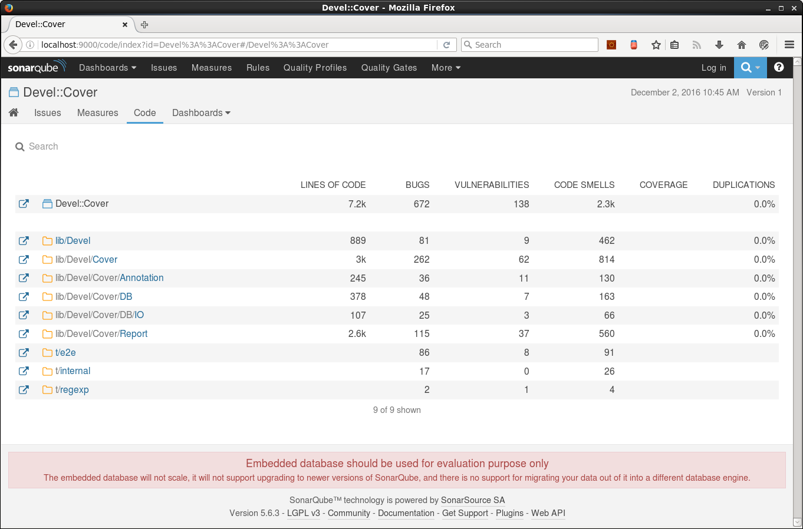
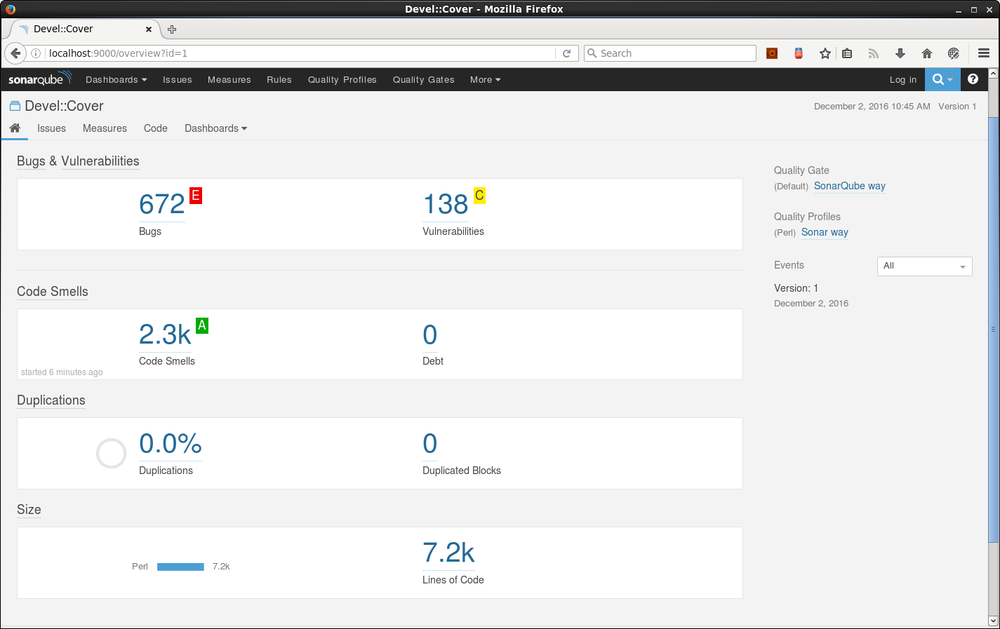
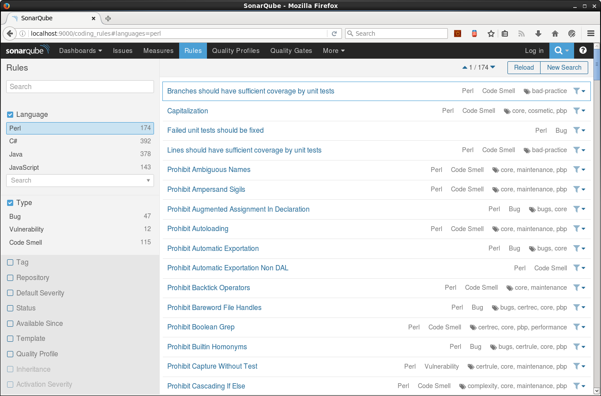

[](https://travis-ci.org/otrosien/sonar-perl)
[](https://sonarqube.com/dashboard/index/com.github.otrosien:sonar-perl)
[](https://sonarqube.com/dashboard/index/com.github.otrosien:sonar-perl)

# SonarQube Perl Plugin

This is a SonarQube plugin to integrate popular features like code coverage,
Perl::Critic and test reporting for perl projects.

## Current State

Current plugin is still at an early stage. It analyzes perl projects
without having to parse the perl code itself, attaching the source as
line-based text. In a later step there would be some proper grammar-based
parsing and analyzing (see bugtracker for current status).

What we have so far...

* LOC reporting (incl. comment and POD lines)
* Structural metrics (classes and functions)
* Test duration metric
* Syntax highlighting of imported code
* Attaching of Perl::Critic issues
* Default profile containing 271 Perl::Critic rules

## Teaser Images









## SNEAK PREVIEW

This will be coming in version 0.3: Coverage Reporting! *please hold the line..*


## Running it

The easiest way to see SonarQube with the Perl Plugin in action is to 
execute our sample perl project with `sonar-scanner` against
a local SonarQube installation using `docker-compose`.

First, start up the SonarQube docker container, that has the
latest sonar-perl installed.

```sh
docker-compose up -d sonarperl
```

Wait for SonarQube to start-up and then open the web interface in your browser
(http://localhost:9000/ - or the IP you bound your docker to).
Then, run the `sonar-scanner` on the sample project.

```sh
docker-compose run sample
```

You should see a "perl sample project" on your SonarQube dashboard.


## Installing into your SonarQube

Plugin releases can be downloaded from our [github releases page](https://github.com/otrosien/sonar-perl/releases). 
If you want to build a snapshot version from source, you can create it via `./gradlew sonar-perl-plugin:jar` and
copy the resulting file (usually suffixed -SNAPSHOT, unless you checked out a release tag) 
e.g. `sonar-perl-plugin/build/libs/sonar-perl-plugin-0.2.6-SNAPSHOT.jar` into the plugins
directory of your SonarQube installation (should be something like `/opt/sonarqube/extensions/plugins/`)


## Analyzing your perl project

1. Make sure your SonarQube is running, and has the latest perl plugin installed
2. [Download](http://docs.sonarqube.org/display/SCAN/Analyzing+with+SonarQube+Scanner) and extract the `sonar-scanner` command-line tool.
3. Create a basic `sonar-project.properties` file. Here is an example:

```
# must be unique in a given SonarQube instance
sonar.projectKey=My::Project
# this is the name displayed in the SonarQube UI
sonar.projectName=My Project
sonar.projectVersion=1.0.0
 
# Path is relative to the sonar-project.properties file. Replace "\" by "/" on Windows.
# Since SonarQube 4.2, this property is optional if sonar.modules is set. 
# If not set, SonarQube starts looking for source code from the directory containing 
# the sonar-project.properties file.
sonar.sources=lib
 
# Encoding of the source code. Default is default system encoding
sonar.sourceEncoding=UTF-8

sonar.tests=t
# testReport.tgz is the default for the report archive.
sonar.perl.testHarness.archivePath=testReport.tgz
```

4. Execute your tests and save the report as `testReport.tgz`. We require a format compatible with `Test::Harness::Archive`.

```
prove -t -a testReport.tgz
```

5. Execute `Perl::Critic` and save the report as `perlcritic_report.txt` in your project. Important is the formatting
instruction below, to make the `perlcritic_report.txt` machine-readable.

```
perlcritic --cruel --quiet --verbose "%f~|~%s~|~%l~|~%c~|~%m~|~%e~|~%p~||~%n" lib t > perlcritic_report.txt
```

5. Run the `sonar-scanner` 
6. Finally open the project report in SonarQube

### Compatibility

We support the current LTS release (5.6) and SonarQube 6.x. Please report bugs
or incompatibilities in our [bugtracker](https://github.com/otrosien/sonar-perl/issues).


## Building all from source

Running a full build includes creation of the plugin-jar and a docker image.
This is achieved by running `./gradlew build`. Note that you 
need to have a local docker daemon running for this.


## Next steps

Please look at the issues in our [bugtracker](https://github.com/otrosien/sonar-perl/issues) for
the planning and status of the next steps. We also appreciate contributions from the community.
So, if you're interested, get in touch with us!


## Links

* [Devel::Cover::Report::Clover](http://search.cpan.org/dist/Devel-Cover-Report-Clover/lib/Devel/Cover/Report/Clover.pm) ([source](https://github.com/captin411/devel-cover-report-clover/))
  and [Sonar Clover Plugin](http://docs.sonarqube.org/display/SONARQUBE45/Clover+Plugin) for coverage reporting
* Perl [TAP](https://testanything.org/) and [SonarQube TAP parser](https://github.com/dbac2002/sonar-tap-parser) for test reporting
* [Perl::Critic](http://perlcritic.org/) for issue reporting
