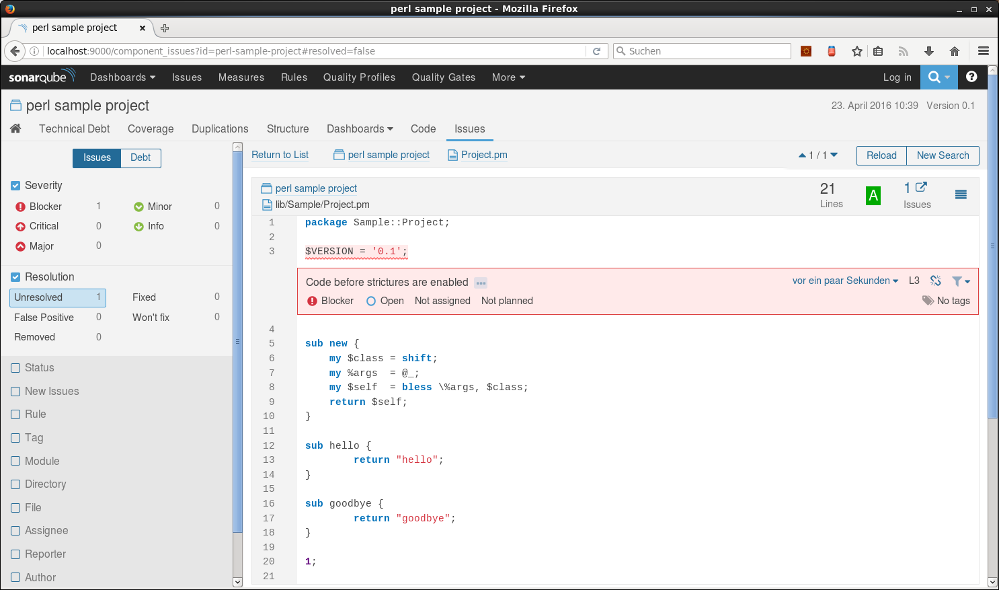

[](https://travis-ci.org/otrosien/sonar-perl) 
[](https://sonarqube.com/dashboard/index/com.github.otrosien:sonar-perl)


# SonarQube Perl Plugin (alpha)

This is a spike to figure out how easy features like code coverage
and Perl::Critic and test reporting can be integrated into sonarqube. 
Given enough interest this could be upgraded into a proper open source project.

## Current State

Current plugin analyzes perl projects without having to parse the perl 
code itself, attaching the raw source as line-based text. In a 
later step there could be some proper parsing and analyzing, e.g. based 
on the ANTLR grammar from the Perl Eclipse integration (EPIC) or
the IntelliJ-Perl grammar.

What we have so far...

* LOC reporting
* Syntax highlighting of imported code
* Perl::Critic issues can be attached

## Teaser Image



## Running it

The easiest way to see SonarQube with the Perl Plugin in action is to 
execute the sample perl project with sonar-scanner in docker-compose.

First, start up the latest sonar-perl

```sh
docker-compose up -d sonarperl
```

Wait for SonarQube to start-up and then open the web interface in your browser (http://localhost:9000/ - or the IP you bound your docker to).
Then, run the sonar-scanner on the sample project.

```sh
docker-compose run sample
```

You should see the perl-sample-project on your SonarQube dashboard.


## Installing into your SonarQube

At the moment the plugin has not been published yet. In order to test it
in your SoarQube installation, you can create the plugin jar with a `./gradlew sonar-perl-plugin:jar` and
copy the resulting file `sonar-perl-plugin/build/sonar-perl-plugin-0.1.5.jar` into the plugins
directory of your sonar installation (should be something like `/opt/sonarqube/extensions/plugins/`)


## Building all from source

Running a full build includes creation of the plugin-jar and a docker image
containing SonarQube and the current plugin. This is achieved by running `./gradlew build`. Note that you 
need to have a local docker daemon running for this.


## Next steps

* The clover report does not contain line-based coverage information. This is crucial for sonarqube to calculate coverage details. Thus, either the clover report needs to be enhanced or we need to find a different solution altogether.

* Test reporting

## Links

* [Devel::Cover::Report::Clover](http://search.cpan.org/dist/Devel-Cover-Report-Clover/lib/Devel/Cover/Report/Clover.pm) 
  and [Sonar Clover Plugin](http://docs.sonarqube.org/display/SONARQUBE45/Clover+Plugin) for coverage reporting
* Perl [TAP](https://testanything.org/) and [SonarQube TAP parser](https://github.com/dbac2002/sonar-tap-parser) for test reporting
* [Perl::Critic](http://perlcritic.org/) for issue reporting
